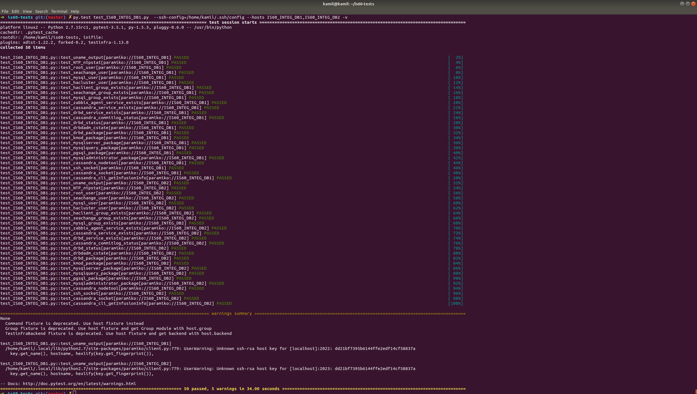

# IS60 infrastructure tests

## installation: 

`$ pip install testinfra`

its also good to install xdist plugin to speedup testing process - (103 vs 51 seconds with "-n8" parameter)
`$ pip install pytest-xdist`

## execution

for DB: `$ py.test --ssh-config=/home/kamil/.ssh/config --hosts IS60_INTEG_DB1,IS60_INTEG_DB2,IS60_INTEG_DB1,IS60_INTEG_DB3 -n8`

for APP: `$ py.test test_IS60_INTEG_APP1.py --ssh-config=/home/kamil/.ssh/config --hosts IS60_INTEG_APP1 -n8 -v`

where /home/kamil/.ssh/config is configuration which allows you to connect to IS60 site

it can also be run from Zabbix proxy: `# py.test test_IS60_INTEG_DB1.py --ssh-config=/root/.ssh/config --hosts 128.168.160.190`
content of .ssh/config:
`User seachange
 StrictHostKeyChecking no`

Sample screenshot:
